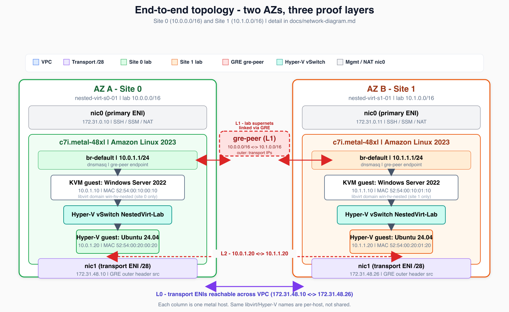

# Nested Virtualization on AWS

**Two-AZ nested lab on EC2 bare metal** - KVM → Windows Server (Hyper-V) → Ubuntu inner VM - with layered routing proofs and automated **ALL GREEN** verification.

**One CloudFormation template runs the full lab** - no repo clone, no laptop scripts, no publisher setup. Upload [`cloudformation/nested-virt-lab.yaml`](cloudformation/nested-virt-lab.yaml), wait for `CREATE_COMPLETE`, then the on-instance pipeline finishes automatically (~**40-90 min**).

**[Deploy](docs/DEPLOY-FROM-CFN.md)** · **[Network topology](docs/network-diagram.md)** · **[Troubleshooting](docs/nested-virt-hiccups.md)** · **[Windows guest notes](docs/hyperv-guest.md)** · **[Security design](docs/SECURITY-EXCEPTIONS.md)** · **[Why this exists](why.md)**

**Internal review:** CSE / security scan scope, scan commands, and documented exceptions are in [**docs/SECURITY-EXCEPTIONS.md**](docs/SECURITY-EXCEPTIONS.md#cse--security-scan-handoff). Run `./scripts/security-scan.sh` before handoff.

---

## Quick start (CloudFormation only)

1. **Get the template:** [`cloudformation/nested-virt-lab.yaml`](cloudformation/nested-virt-lab.yaml) (download or pull from this repo).
2. **Deploy:** CloudFormation console → **Create stack** → **Upload a template file** - or CLI via S3 `--template-url` ([guide](docs/DEPLOY-FROM-CFN.md)).
3. **Parameters:** `KeyName`, `VpcId`, four subnets (metal + transport `/28` per AZ). Optional: `RootNotifyEmail` (SNS when GREEN), `WindowsIsoDownloadUrl`, `InstanceType`.
4. Acknowledge **`CAPABILITY_NAMED_IAM`**.
5. Wait for **`CREATE_COMPLETE`** (~5 min) - metal hosts bootstrap and the **lab pipeline starts on its own** (peer routing, Windows L1, Hyper-V L2, verification).
6. **Confirm ALL GREEN** (~40-90 min after step 5):

```bash
aws ssm get-parameter --name /nested-virt/lab/verification \
  --region YOUR_REGION --query Parameter.Value --output text | python3 -m json.tool
```

Look for `"status": "GREEN"` and confirm each `instance_id` matches the stack outputs `Site0InstanceId` / `Site1InstanceId`.

**Optional (cloned repo):** `./bin/monitor-lab-until-green.sh` polls and rejects stale SSM. Full guide: [**docs/DEPLOY-FROM-CFN.md**](docs/DEPLOY-FROM-CFN.md)

---

## Architecture

[](docs/diagrams/end-to-end.svg)

| Color | Network | Role |
|-------|---------|------|
| Blue | `172.31.0.0/16` VPC | EC2 ENIs, IGW, SSM |
| Purple | Transport `/28` per AZ | `kvm-host-nic1` - GRE outer header |
| Green / Orange | `10.0.0.0/16` / `10.1.0.0/16` | Site lab supernets (guests on `10.{site}.1.0/24`) |
| Red (dashed) | `gre-peer` | Cross-AZ lab encapsulation |
| Teal | `NestedVirt-Lab` vSwitch | Hyper-V L2 extension of `br-default` |

Routing layers **L0-L2**, packet walk, Mermaid source: [**docs/network-diagram.md**](docs/network-diagram.md)

---

## What this is

A **production-grade laboratory** - not a hello-world nested virt demo. Lift a legacy virtualization stack into AWS, validate every layer independently, break each failure domain on purpose, and prove root cause with repeatable diagnostics.

```
c7i.metal (Amazon Linux 2023)
  └── KVM / libvirt (br-default)
        └── Windows Server 2022 + Hyper-V @ 10.{site}.1.10
              └── Ubuntu 24.04 inner @ 10.{site}.1.20
```

Cross-AZ routing uses **transport ENIs + GRE** because lab `10.x` space does not ride the VPC fabric natively.

**Stuck?** [Troubleshooting index](docs/nested-virt-hiccups.md#quick-index-by-phase) · [Security design](docs/SECURITY-EXCEPTIONS.md)

---

## Why this exists

Reality has deadlines - datacenter leases, acquisitions, payroll Monday. Nested virt is the **bridge**: move first, stabilize, modernize on your timeline.

The long version (Tony, continuity vs modernization, failure isolation): [**why.md**](why.md)

---

## Who this is for

Infrastructure engineers, platform teams, and architects responsible for **impossible migrations** - people who need to **prove** every layer, not assume it.

Not a quick nested-virt tutorial. If you want a lab that intentionally breaks so you can learn where production lies, welcome home.

---

> **Modernization is a business strategy. Continuity is an operational requirement.** Sometimes those timelines don't match.

> *Automation amplifies your understanding of complexity - or your misunderstanding of it. Production doesn't care which one it is.*
