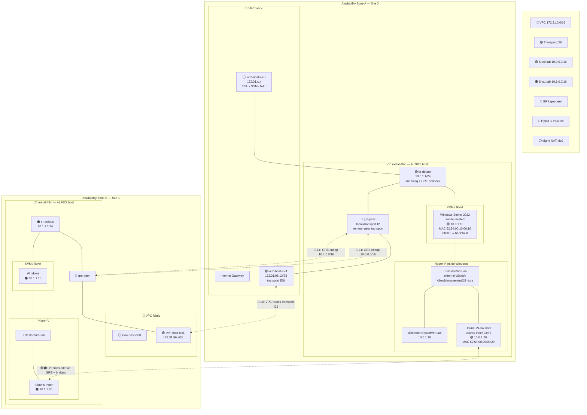
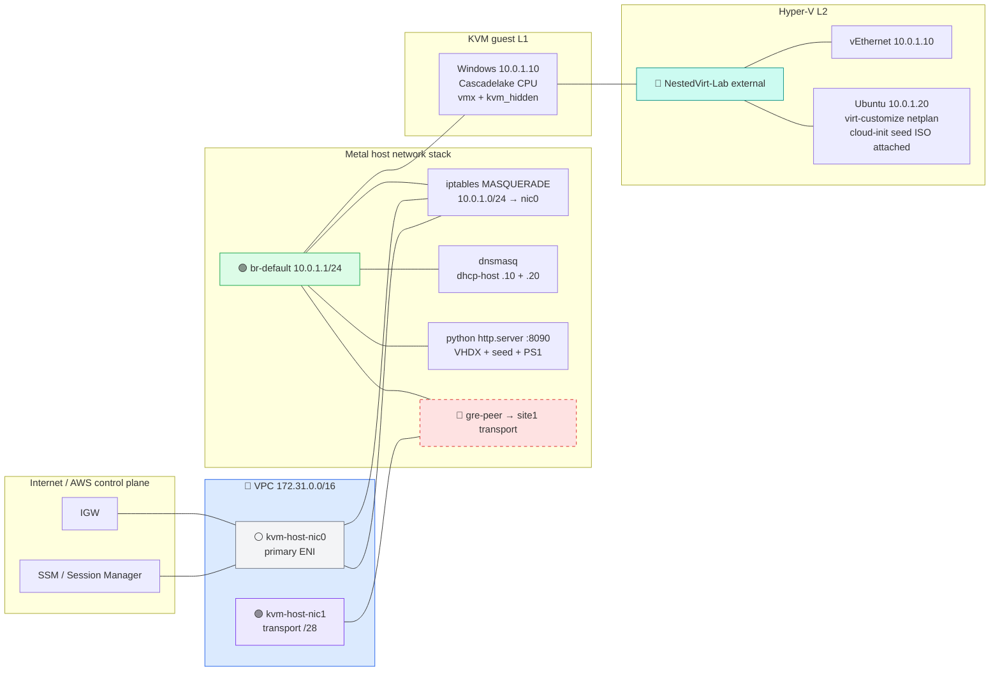
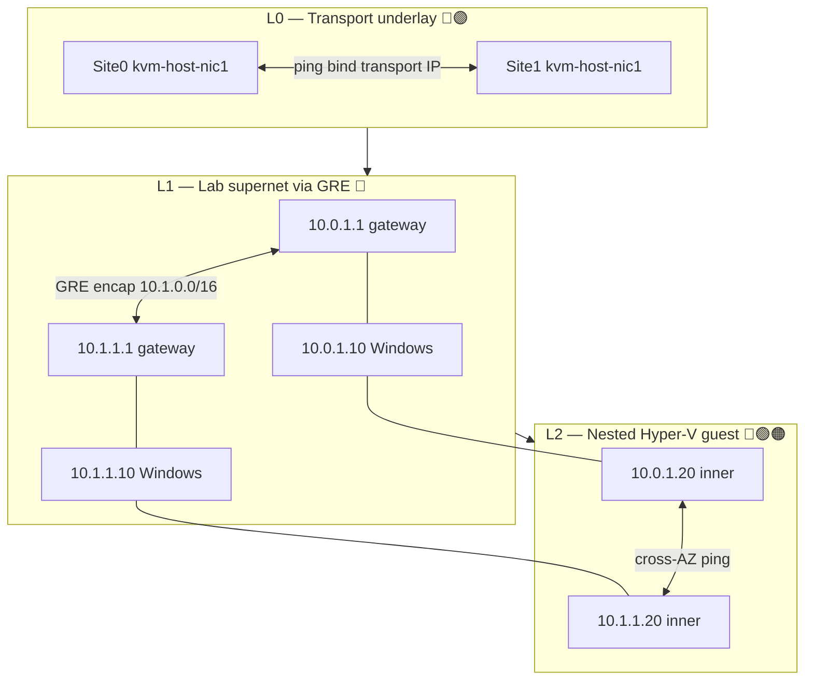
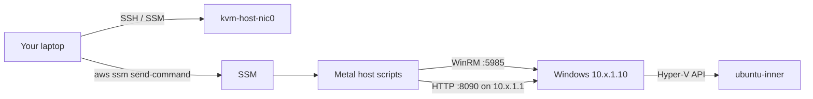

# Network diagram

Color-coded map of every network in the **nested-virt** two-AZ lab. Use this with [BUILD.md](BUILD.md) for context and [nested-virt-hiccups.md](nested-virt-hiccups.md) when something breaks.

## Legend (color = network domain)

| Color | Network | CIDR / name | Role |
|-------|---------|-------------|------|
| 🔵 Blue | **AWS VPC fabric** | `172.31.0.0/16` | EC2 primary ENI, IGW, SSM, inter-host transport underlay |
| 🟣 Purple | **Transport ENI subnet** | `/28` per AZ (tag `win-metal-hv-nic-{az}`) | Dedicated uplink for `kvm-host-nic1`; GRE outer header |
| 🟢 Green | **Site 0 lab supernet** | `10.0.0.0/16` | All lab bridges, guests, dnsmasq on site 0 |
| 🟠 Orange | **Site 1 lab supernet** | `10.1.0.0/16` | Same layout, site id `1` |
| 🔴 Red (dashed) | **GRE overlay** | `gre-peer` tunnel | Encapsulates peer lab `10.x/16` inside transport IPs |
| 🩵 Teal | **Hyper-V vSwitch** | `NestedVirt-Lab` (external) | L2 extension of `br-default` inside Windows guest |
| ⚪ Gray | **Management / NAT** | `kvm-host-nic0` (primary ENI) | SSH, SSM, outbound internet; NAT for `10.{site}.1.0/24` |

### Key addresses (site 0 example)

| Address | Device | Notes |
|---------|--------|-------|
| `172.31.x.x` | `kvm-host-nic0` | Public or VPC-routable management |
| `172.31.96.x` | `kvm-host-nic1` | Transport ENI (example: `172.31.96.13`) |
| `10.0.1.1` | `br-default` on metal | Lab gateway, dnsmasq, HTTP serve for inner deploy |
| `10.0.1.10` | Windows KVM guest | Hyper-V host; MAC `52:54:00:10:00:10` |
| `10.0.1.20` | Ubuntu Hyper-V inner | MAC `52:54:00:20:00:20` |

Site 1 mirrors with `10.1.*` and its own transport IP.

---

## End-to-end topology (both AZs)

---

## Single-site detail (Site 0)

---

## Routing layers (what each proof tests)

| Layer | Command | Proves |
|-------|---------|--------|
| L0 | `./invoke-routing-proof.sh --layer l0` | Transport ENIs reachable across VPC |
| L1 | `--layer l1` | Remote lab gateway (`10.x.1.1`) via GRE |
| L1 cross | `--layer l1-cross` | Remote Windows guest `.10` |
| L2 | `--layer l2` | Inner Ubuntu `.20` local + cross-site |
| All | `--layer all` | Full matrix |

---

## Additional lab bridges (provisioned, not on critical path)

`bootstrap.sh` creates extra bridges for future chaos / multi-segment demos. Each uses `10.{site}.*`:

| Bridge | Gateway | Purpose |
|--------|---------|---------|
| `br-default` | `10.{site}.1.1/24` | **Primary lab** — Windows + inner |
| `br-production` | `10.{site}.16.1/20` | Production segment |
| `br-dev` | `10.{site}.64.1/19` | Dev segment |
| `br-qa` | `10.{site}.96.1/22` | QA segment |
| `br-backup` | `10.{site}.100.1/24` | Backup segment |
| `br-monitoring` | `10.{site}.101.1/24` | Monitoring |
| `br-heartbeat` | `10.{site}.102.1/24` | Heartbeat |
| `br-cluster` | `10.{site}.250.1/24` | Bound to `kvm-host-nic2` |

Only `br-default` is required for the nested-virt proof stack today.

---

## Packet walk: Site 0 inner → Site 1 inner (L2 cross-site)

1. **Source** `10.0.1.20` (Hyper-V Ubuntu) → external vSwitch → Windows `vEthernet` → KVM e1000 → **`br-default`**
2. **Default route** on inner: via `10.0.1.1` (metal gateway)
3. **Metal host** matches `10.1.0.0/16` → **`gre-peer`** (src `10.0.1.1`, outer header `172.31.96.x ↔ 172.31.96.y`)
4. **VPC** delivers GRE to peer transport ENI (L0)
5. **Site 1 metal** decaps GRE → forwards into **`br-default`** / `10.1.1.0/24`
6. **Hyper-V path** on site 1 → inner `10.1.1.20`

Reverse path symmetric with `10.0.0.0/16` encap on site 1.

---

## Management / provisioning paths (dashed = out-of-band)

Scripts land on metal via **S3 bootstrap bucket** + SSM; Windows is configured over **WinRM**; inner VM disk/seed served over **HTTP from lab gateway**.

---

*See [BUILD.md](BUILD.md) for how this was built and [nested-virt-hiccups.md](nested-virt-hiccups.md) when a layer lies.*
